# fit-fuel

 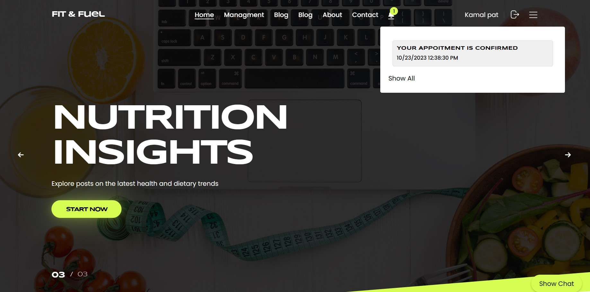

This ASP.NET MVC project is a web application designed to facilitate interactions between three user roles: admin, nutritionist, and patient.
It has all the required functionality for new users, so that they can achieve their healthy lifestyle and diet goals by connecting with the best nutritionists through this platform, where they can access personalized advice and plans tailored to their unique needs and objectives.

## Live URL

For detailed Live Demo, please refer to the [Live-Demo](https://fit-and-fuel20231024140058.azurewebsites.net/).

## Domain Model & Database Schema Diagram

Here's a simplified domain model representing the key entities and their relationships in the  application:
https://drive.google.com/file/d/1Dh0ZuFSjf4jveGxsQl1qKTl23JGyvgva/view?usp=sharing

## data base design 
 
 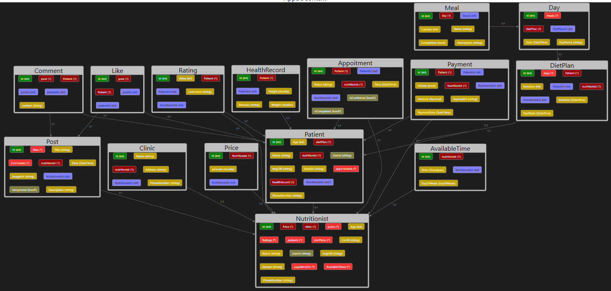
 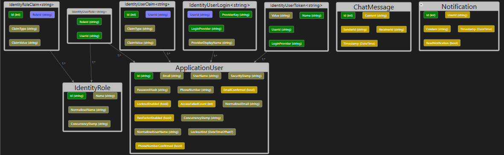

## Software Requirements

For detailed software requirements, please refer to the [Software Requirements](https://github.com/Group3-Runtime-Terror-Team/Teem-Agreement) document.

## Background
 
Mobile technology and health applications have affected the way nutritionist’s education and practice is carried out. So, Fit&Fuel web application came to revolutionize the way nutritionists and patients interact, providing a seamless platform for personalized health services. This web App aims to address the challenges of accessibility to nutritionists and the management of health information. We aim to improve individuals' well-being by offering convenient access to professional guidance and make healthy lifestyle adjustments.

## Problem Statement

Our project addresses the difficulties and obstacles that patients face when seeking nutritional services. Many people struggle with accessing clinics, tracking their health information, and maintaining a consistent health regimen. By offering an online platform, we make it easier for individuals to connect with certified nutritionists and manage their health goals.

## Why Choosing us

Our platform is significant because it empowers both nutritionists and patients. Nutritionists can expand their reach beyond physical clinics, and patients can receive expert guidance from the comfort of their homes. By utilizing technology and a collaborative environment, we enhance the quality of health services and promote healthier lifestyles.

## Objectives

The main focus of our platform is to support nutritionists and patients in organizing their relationships in order to obtain the desired service for an affordable cost, with high quality, and with minimal effort and time spent.
It also offers a wide range of health services, including:

-	Improve the Health of people. 
-	Implement useful and user-friendly Web application.
-	Provide real time interaction between patients and nutritionist. 
-	Provide highly qualified nutritionists in one platform.
-	Help nutritionist to Store, manage and track of patient’s medical record.
-	Saving money, effort, and time for the user of the system, because all of these are available Online.

## Scope (In)

- Nutritionists can view and manage appointments online.
- Patients can search for nutritionists based on specialization and ratings.
- Nutritionists can create and manage personalized diet plans.
- Patients can track daily caloric intake and progress towards health goals.

## Scope (Out)

- Our application will not provide medical diagnoses or treatments.
- We will not offer features unrelated to health and nutrition services.

## Minimum Viable Product (MVP)

- Users can register on our platform as a patient or as a nutritionist (who has a physical clinic or not).
- Nutritionists should be qualified enough to register on our platform, so the admin will confirm their CVs before any registration.
- Nutritionists can enter information for his/her clinic if he/she has.
- Nutritionists can view and manage appointments online (accept or reject them).
- Patients can search for nutritionists and filter them by their ratings.
- Patients can be searched for by their names from their nutritionists. 
- Patients can book appointments from the available times for this Nutritionist.
-  Patients can enter the important information for a dietitian when evaluating a patient's health and fitness and these information can be tracked and updated during the Diet duration.
- Nutritionists can create and manage a full detailed diet plans for their Patients based on the indicators of the patient's health records.
- Patients can track their diet plans day by day and meal by meal with their caloric intake and their nutritionists can do this too.
- Nutritionists can Post a post and patients can interact with them by like and comment.
- Patients and nutritionists can communicate continuously through their real time chats.
- We involved a notification system inside our platform.
- Payment feature 
- We have an Admin for the website who can manage several things like registration, posts, payment etc.

## Stretch Goals

- Enhance the dashboard with graphical representation of health progress.
- Enhance the Payment feature to be done through our website and give it a high level of security.
- make a mobile application version of our platform.
- include a high-quality Gym and a highly qualified coach references.
- include google maps to in our platform to empower the patients to get the closest nutritionist’s clinics for them. 

## Technologies

- Programming Language: C#
- Framework: ASP.NET Core 
- Identity Framework
- Real-Time Communication: SingleR
- Database: Microsoft SQL Server
- API Documentation: Swagger
- Unit Testing: xUnit

## Tools

- Task management Tool: Asana
- For Communication:  Zoom, Discord, Slack
- For presentation: Canva
- Version Controller: GitHub
- IDE: Visual Studio

## Features:

### Appointments

- **Appointments**: Schedule and manage appointments with ease. View your upcoming appointments, confirm them, and mark them as completed.

### Available Times

- **Available Times**: Nutritionists can manage their available time slots for appointments. Patients can select a convenient time for their appointments.

### Chat

- **Chat**: Communicate securely with your healthcare provider or fellow users through our built-in chat system.

### Clinics

- **Clinics**: Nutritionists can create and manage their clinics. Patients can find clinics associated with their nutritionist.

### Comments

- **Comments**: Leave comments or feedback on your experience. Update or delete your comments as needed.

### Days and Diet Plans

- **Days and Diet Plans**: Nutritionists can create and manage dietary plans for their patients, including specific meal plans for each day.

### Health Records

- **Health Records**: Access and manage health records associated with a nutritionist's user ID.

### Likes

- **Likes**: Add likes to posts and manage them as needed.

### Meals

- **Meals**: View, add, update, and delete meals as part of dietary plans.

### Notifications

- **Notifications**: Stay informed with notifications and send messages to other users.

### Nutritionists

- **Nutritionists**: Find and manage nutritionist profiles, patients, and diet plans.

### Patients

- **Patients**: View patient profiles, diet plans, and meals. Assign and manage nutritionists.

### Payments

- **Payments**: Process payments securely and record them in the system.

### Posts

- **Posts**: Create, view, update, and delete posts. Mark posts as improved.

### Ratings

- **Ratings**: Rate and comment on nutritionists and filter them by average rating.

### Users

- **Users**: Register, log in, view user information, change passwords, and assign roles.

## Challenges while coding

-	Retrieving only a specific user's data instead of all the data for all the users in the database. 
-	Authorization (tokens) in postman was hard so we solved it by enabling it in swagger.
-	Testing and Mocking
-	Error Handling and Reporting
-	Designing a Clean and Intuitive (strong) API.
-   Impmlementing and designing the interface.
-   fixing the bugs, and improving the usability. 

## Data Flow

 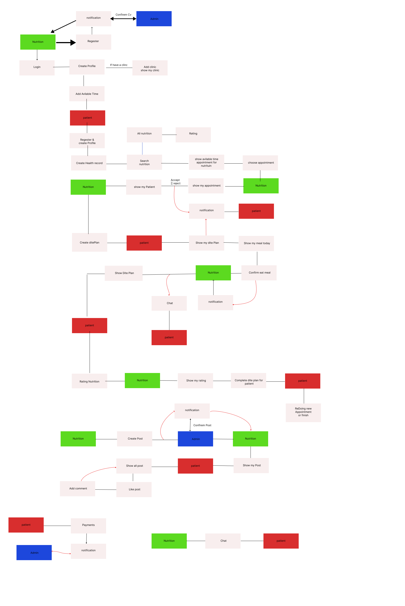

## Non-Functional Requirements

### Security

- All user data will be encrypted and securely stored in the database using industry-standard encryption algorithms.
- Authentication and authorization will be implemented to ensure only authorized users can access certain features.

### Usability

- The user interface will be designed with user-friendliness in mind, offering intuitive navigation and clear instructions.
- Accessibility: features will be included to accommodate users with disabilities.
- Availability: it allows the user to use the system whenever he wishes and whenever he wants.

### some of the pages from the website:
 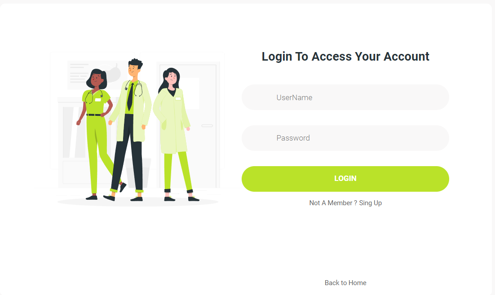
 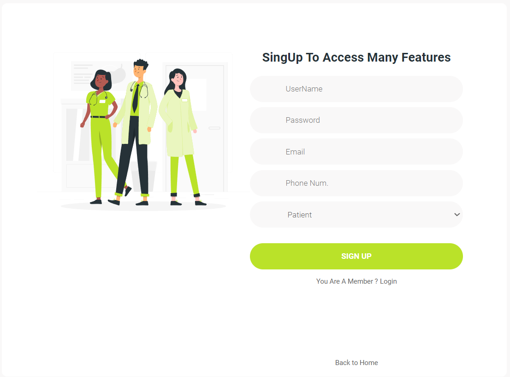

 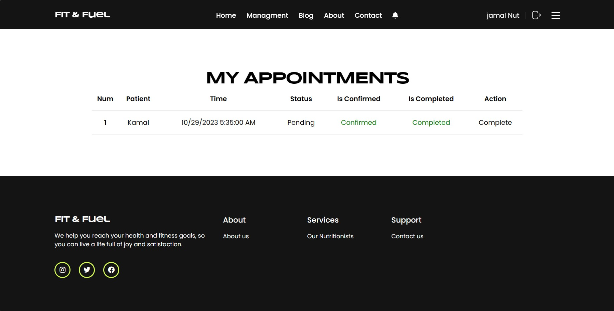
 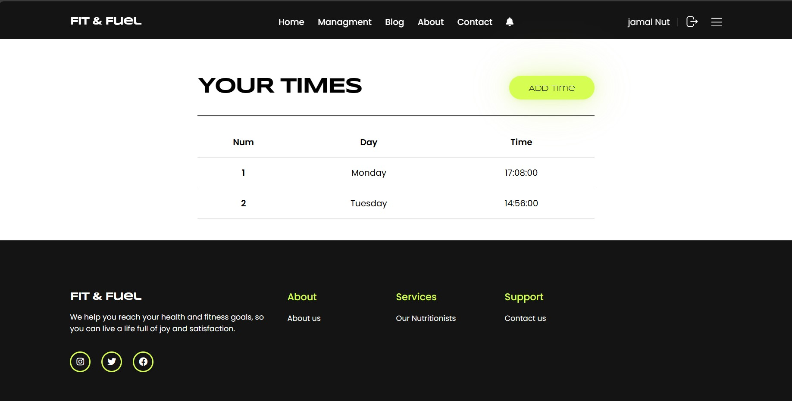
 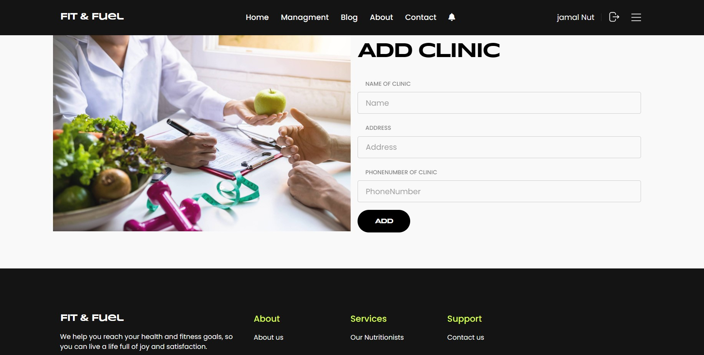
 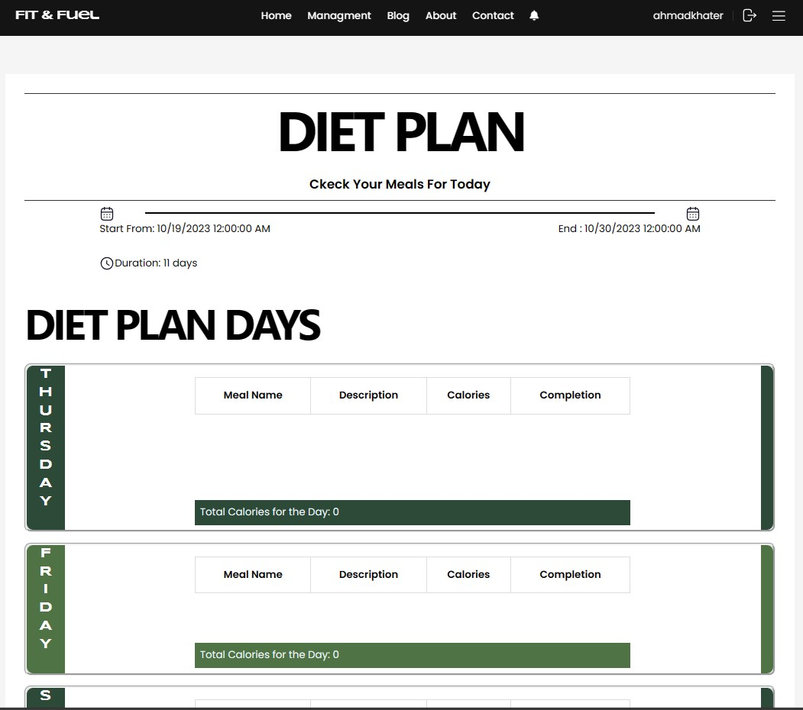
 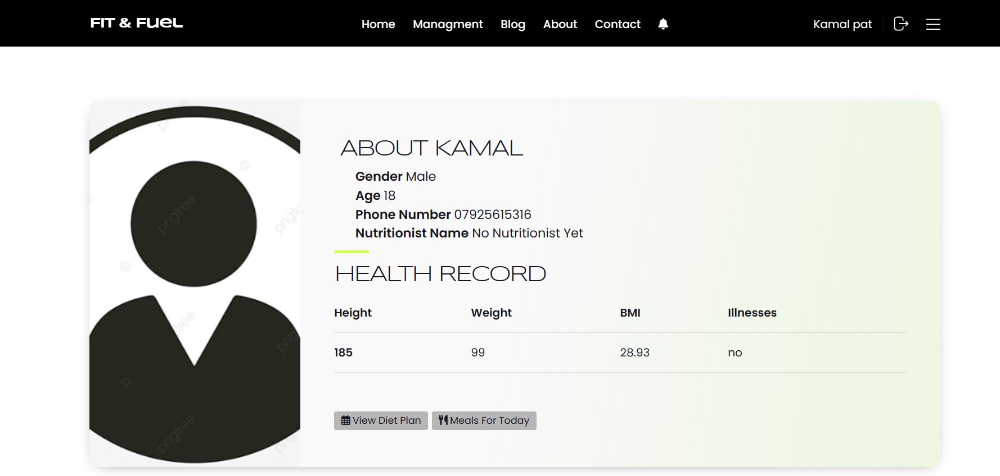
 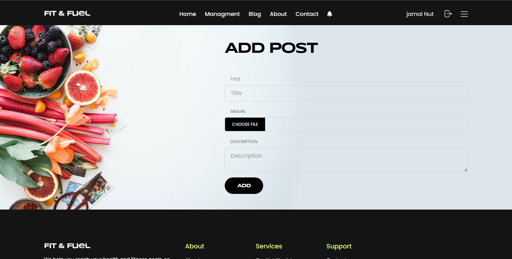

